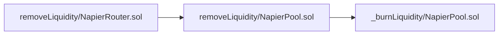

Strong Blue Gorilla

medium

# The slippage check in ```removeLiquidity``` function can be bypassed by donating liquidity directly to the napier pool

## Summary
The slippage check in the  ```removeLiquidity``` function can be bypassed by donating liquidity directly to the napier pool.
## Vulnerability Detail
In ```NapierRouter.sol```, the ```removeLiquidity``` function has codes as follows:
```solidity
        IERC20(pool).safeTransferFrom(msg.sender, pool, liquidity);
        // @audit-check What if someone transfer liquidity to pool directly ?
        (uint256 underlyingOut, uint256 baseLptOut) = INapierPool(pool).removeLiquidity(address(this));

        // Check slippage for underlying
        // @audit-check The check of slippage can be bypassed by donating liquidity to the pool
        if (underlyingOut < underlyingOutMin) revert Errors.RouterInsufficientUnderlyingOut();
```
The user flow of removing liquidity is as follows:

First the ```NapierRouter``` contract transfer LP tokens to ```NapierPool``` contract. Then the amount of LP tokens to be burned depends on ```balanceOf(address(this))``` in ```NapierPool``` contract. So the burned liquidity can be manipulated by donating liquidity directly to  ```NapierPool``` contract.
So the attack path can be as follows:
1. The attacker donates some LP tokens directly to ```NapierPool``` contract
2. The user calls ```removeLiquidity``` function in ```NapierRouter``` contract. Because the ```NapierPool``` contract already has some some LP tokens. The amount of LP tokens to be burned is more than user want. The ```underlyingOut``` is more than it should be. The ```underlyingOut``` will be more than ```underlyingOutMin``` (assume normally the ```underlyingOut``` will be less than ```underlyingOutMin```). So the slippage check will be bypassed.

I'm not sure if the attacker has the incentive to do so, but it could happen.
## Impact
The slippage check in the  ```removeLiquidity``` function can be bypassed.
## Code Snippet
https://github.com/sherlock-audit/2024-01-napier/blob/main/v1-pool/src/NapierRouter.sol#L684-L690
https://github.com/sherlock-audit/2024-01-napier/blob/main/v1-pool/src/NapierPool.sol#L273-L276
## Tool used
Manual Review
## Recommendation
Don't let the amount of LP tokens to be burned depend on the ```balanceOf(address(this))```.